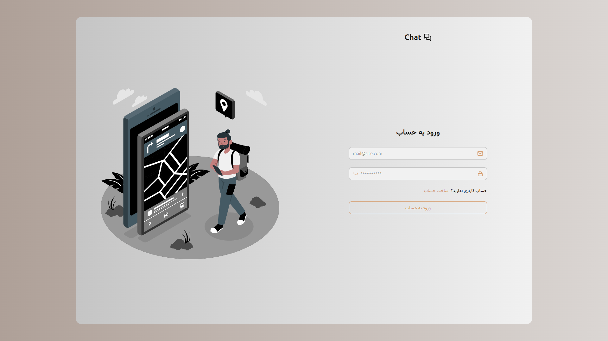
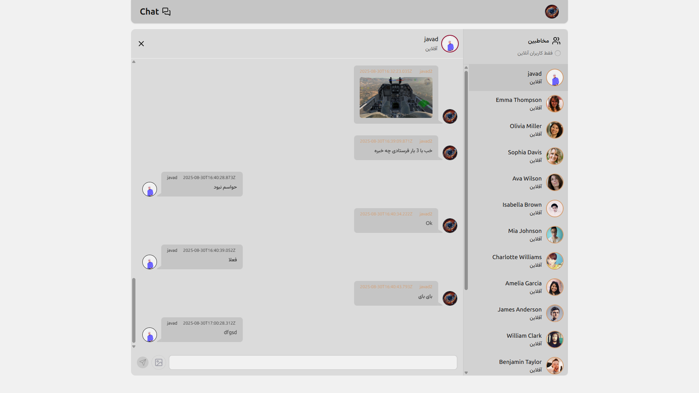

# Real-time Chat Application

A full-stack real-time chat application built with React, Node.js, Express, and Socket.IO. This application allows users to sign up, log in, and engage in real-time messaging with other users.




[**Live Demo**](https://mern-chatapp-1-rkb8.onrender.com)

## Features

-   User authentication (sign up, login, logout)
-   Real-time messaging using Socket.IO
-   Modern UI with theme support (light/dark mode)
-   Responsive design for desktop and mobile
-   Message history persistence
-   Online user status indicators

## Tech Stack

### Frontend

-   React 19 with hooks
-   React Router for navigation
-   TailwindCSS with DaisyUI components
-   Zustand for state management
-   Socket.IO Client for real-time communication
-   Axios for HTTP requests
-   Lucide React for icons

### Backend

-   Node.js with Express.js
-   MongoDB with Mongoose ODM
-   Socket.IO for real-time communication
-   JWT for authentication
-   Bcrypt.js for password hashing
-   Cloudinary for image storage
-   Cookie-parser for handling cookies
-   CORS for cross-origin resource sharing

## Installation

### Prerequisites

-   Node.js (v14 or higher)
-   MongoDB instance (local or cloud)
-   Cloudinary account for image storage

### Steps

1. Clone the repository:

```bash
git clone <repository-url>
cd chatapp
```

2. Install backend dependencies:

```bash
cd backend
npm install
```

3. Install frontend dependencies:

```bash
cd ../frontend
npm install
```

4. Set up environment variables:
    - In the `backend` directory, create a `.env` file with the following variables:
        ```
        PORT=5001
        MONGO_URI=your_mongodb_connection_string
        JWT_SECRET=your_jwt_secret
        CLOUDINARY_CLOUD_NAME=your_cloud_name
        CLOUDINARY_API_KEY=your_api_key
        CLOUDINARY_API_SECRET=your_api_secret
        NODE_ENV=development
        ```

## Usage

### Development

1. Start the backend server:

```bash
cd backend
npm run dev
```

2. Start the frontend development server:

```bash
cd frontend
npm run dev
```

The application will be available at `http://localhost:5173` and the backend API at `http://localhost:5001`.

### Production

1. Build the frontend:

```bash
cd frontend
npm run build
```

2. Start the backend server (serves the frontend build):

```bash
cd backend
npm start
```

## Project Structure

```
chatapp/
├── backend/
│   ├── src/
│   │   ├── controllers/     # Request handlers
│   │   ├── lib/             # Database and socket configuration
│   │   ├── middlewares/     # Authentication middleware
│   │   ├── models/          # Database models
│   │   ├── routes/          # API routes
│   │   ├── seeds/           # Database seed data
│   │   ├── utils/           # Utility functions
│   │   └── index.js         # Entry point
│   └── ...
└── frontend/
    ├── src/
    │   ├── components/      # React components
    │   ├── constants/       # Application constants
    │   ├── lib/             # HTTP client configuration
    │   ├── pages/           # Page components
    │   ├── routes/          # Route definitions
    │   ├── store/           # State management
    │   ├── App.jsx          # Main app component
    │   └── main.jsx         # Entry point
    └── ...
```

## Contributing

Contributions are welcome! Please follow these steps:

1. Fork the repository
2. Create a feature branch (`git checkout -b feature/AmazingFeature`)
3. Commit your changes (`git commit -m 'Add some AmazingFeature'`)
4. Push to the branch (`git push origin feature/AmazingFeature`)
5. Open a pull request

## License

This project is licensed under the ISC License - see the [LICENSE](LICENSE) file for details.

## Contact

For support or queries, please open an issue in the repository.
